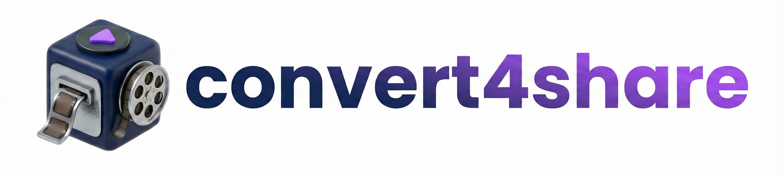

# Convert4Share

`Convert4Share` is a cross-platform (Windows and Linux) desktop application designed to convert `.mov` and `.heic` files into the more widely compatible `.mp4` and `.jpg` formats.

It features a modern GUI and integrates with the file manager via file associations — the Windows Shell's "Open with" / "Send to" context menus on Windows, and the desktop database (`.desktop` MimeType entry) on Linux — allowing for quick and easy file conversions directly from the file explorer.

## Key Features

- **File Conversion**:
  - Converts `.mov` (QuickTime Video) files to `.mp4` (H.264/AAC).
  - Converts `.heic` (High-Efficiency Image Format) files to `.jpg`.
  - **HEIC Max Resolution**: Configurable limit for the longest side of converted images (default: 2560px).
  - **MP4 Smart Passthrough**: Incoming `.mp4` files are inspected rather than trusted. One that is already shareable — H.264 in `yuv420p`, within the size limit, with AAC or MP3 audio — is copied untouched. One that is not, such as the H.265 exports messengers and phones produce, is re-encoded to H.264. Audio that is already AAC is passed through without a second encode.
  - **Pass-through (Copy Only)**: Optionally skip conversion and copy files directly for specific extensions (default: `.jpg`, `.jpeg`). This overrides the MP4 check, so adding `.mp4` here restores unconditional copying.
- **Live Photo Detection**:
  - Automatically detects and skips the `.mov` component of Apple Live Photos if the corresponding `.heic` file is in the same batch.
- **Drag & Drop Interface**:
  - Simply drag files onto the application window to add them to the conversion queue.
- **Hardware Acceleration**:
  - Select a hardware encoder in Settings for faster video conversion: NVIDIA NVENC (`h264_nvenc`, Windows and Linux), AMD AMF (`h264_amf`, Windows-only), and VAAPI (`h264_vaapi`, for Intel/AMD GPUs on Linux). The default is software encoding (`libx264`); the encoder is chosen from the dropdown, not auto-detected.
- **Quality Presets**:
  - Supports 'High', 'Medium', and 'Low' quality presets for video conversion, dynamically adjusting bitrates (5Mbps, 2.5Mbps, 1Mbps) and hardware flags.
- **Concurrent Processing**:
  - Boosts performance by processing multiple image conversions in parallel (configurable limit). Video conversions are processed one at a time to ensure stability.
- **Smart Output Path**:
  - Configurable "exclude patterns" allow you to divert output to a specific directory (e.g., `Pictures`) if the source path contains certain keywords (e.g., `Cloud`).
  - Otherwise, the converted file is saved in the same directory as the original file.
- **Theme Support**:
  - Fully supports Light and Dark modes (defaults to Dark), matching your system preference or manual toggle.
- **Single Instance Execution**:
  - Ensures that only one instance of the application runs at a time. If you select multiple files to convert, they are queued and processed by the single master instance.

## Prerequisites

For `Convert4Share` to function correctly, the following tools are required:

- **FFmpeg**: Required for video conversion.
- **FFprobe**: Required to inspect incoming MP4 files. It ships with FFmpeg, so installing FFmpeg covers it; the app looks for it next to the FFmpeg binary before falling back to `PATH`. Without it, every MP4 is re-encoded instead of copied.
- **ImageMagick**: Required for image conversion. On ImageMagick v6 the binary is named `convert` rather than `magick`; the app handles both.

The application automatically attempts to detect these binaries in your system `PATH`, as well as standard `WinGet` installation locations on Windows. You can also manually configure the paths in the Settings if they are not detected.

> **Linux: HEIC decoding needs libheif ≥ 1.18.** ImageMagick decodes HEIC through `libheif`. Versions before 1.18 (including the **1.17.x** shipped by Ubuntu 24.04) fail on newer Apple HEIC files that carry multiple auxiliary images — HDR gain map, depth/segmentation mattes — with `Too many auxiliary image references`. If you hit that error, upgrade `libheif` to 1.18 or newer (via a newer distro release, a backport/PPA, or building from source). The app surfaces an actionable message when it detects this failure.

On **Windows**, install the prerequisites via `winget` (or your preferred method). On **Linux**, install them through your system package manager, e.g.:

```shell
# Debian/Ubuntu
sudo apt install ffmpeg imagemagick

# Fedora
sudo dnf install ffmpeg ImageMagick

# Arch
sudo pacman -S ffmpeg imagemagick
```

### Optional (Linux): Clipboard tools

The **Copy** button copies a converted file to the clipboard. On Linux this requires either `wl-clipboard` (Wayland) or `xclip` (X11) to be installed; install whichever matches your session. On Windows this works out of the box (PowerShell).

## Building from Source

You need **Go** (1.25+), **Node.js** with **npm**, and **go-task** installed. The Wails v3 CLI is fetched on demand by Taskfile targets.

On **Linux**, building also requires `CGO_ENABLED=1` and the following system development packages:

```shell
# Debian/Ubuntu
sudo apt install pkg-config libgtk-3-dev libwebkit2gtk-4.1-dev

# Fedora
sudo dnf install pkgconf-pkg-config gtk3-devel webkit2gtk4.1-devel

# Arch
sudo pacman -S pkgconf gtk3 webkit2gtk-4.1
```

```shell
# Development build (frontend + Go binary)
#   Windows -> bin/convert4share.exe
#   Linux   -> bin/convert4share
task build

# Production build (-tags production, stripped; -H windowsgui on Windows only)
task build PRODUCTION=true

# Run the built executable
task run

# Live dev mode (Vite + wails3 dev)
task dev

# Regenerate Wails v3 frontend bindings after changing internal/services/* method signatures
task generate:bindings

# Regenerate build assets (manifest, .syso, NSIS templates, nfpm config) after editing build/config.yml
task common:update:build-assets
```

The Go entry point is `cmd/convert4share/main.go` and embeds `cmd/convert4share/dist/` (populated by `task common:build:frontend` from `frontend/dist`).

### Packaging

`task package` produces a native installer for the host OS.

- **Windows (NSIS installer)**: Requires `makensis` on `PATH` (NSIS 3+). The installer registers Convert4Share as the handler for `.mov` and `.heic` (declared in `build/config.yml`) via the Windows registry, so no separate install step is needed at runtime.
- **Linux (.deb via nfpm)**: Builds a `.deb` package using [nfpm](https://nfpm.goreleaser.com/) (`rpm` and `archlinux` variants are also supported). The package installs the binary, the application icon, and a `.desktop` entry. File associations on Linux come from the `.desktop` `MimeType` declaration and the desktop database rather than the Windows NSIS/registry flow.

## How to Use

### File Manager Integration (Recommended)

The installers produced by `task package` register Convert4Share as a handler for `.mov` and `.heic` files at install time.

- **Windows**: After installation, right-click a `.mov` or `.heic` in Explorer and choose **Open with → Convert4Share** to launch a conversion.
- **Linux**: After installing the `.deb` (or `.rpm`/archlinux package), the bundled `.desktop` entry registers the same associations in the desktop database; open a `.mov` or `.heic` with Convert4Share from your file manager.

No in-app install button or admin CLI is needed — the file associations are declared in `build/config.yml`.

If you prefer not to use the installer, you can still launch the app and drop files into the window (see Drag & Drop) or invoke it from the command line.

### Command Line

Pass file paths as arguments. The running instance (if any) receives them via the Wails v3 single-instance lock and queues them automatically:

```shell
# Windows
convert4share.exe "C:\path\to\your\video.mov" "C:\path\to\your\photo.heic"

# Linux
convert4share /path/to/your/video.mov /path/to/your/photo.heic
```

### Drag & Drop

Drag files onto the application window; the drop target is the main DropZone (highlighted via Wails v3's `.file-drop-target-active` class).

## License

This project is licensed under the **GNU Affero General Public License v3.0 (AGPL-3.0)**. The full license text can be found in the `LICENSE` file.
